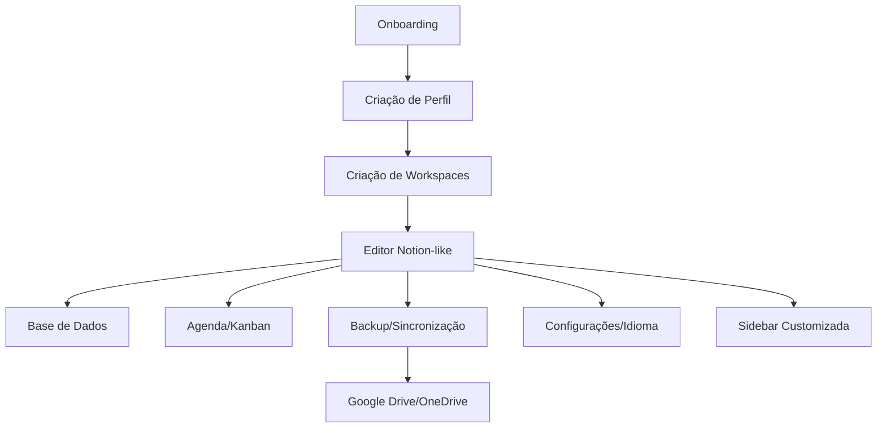

<div align="center">
  
  
  <h1>Bloquinho</h1>
  <h3>Workspace Self-Hosted Profissional — 100% Flutter</h3>
  <p>O seu Notion privado, offline, multiplataforma e sem limites.</p>
</div>

---

<p align="center">
  <b>🇵🇹 Português</b> | <a href="#">🇺🇸 English</a> | <a href="#">🇫🇷 Français</a>
</p>

---

<div align="center">
  
  
  
  
  
</div>

---

# ✨ O que é o Bloquinho?

O **Bloquinho** é um workspace pessoal e profissional, inspirado no Notion, totalmente self-hosted, multiplataforma e sem limites. Desenvolvido em Flutter, oferece editor de páginas com blocos ricos, base de dados tipo Notion, agenda integrada, sistema de backup automático, sincronização com nuvem (Google Drive/OneDrive), internacionalização completa (PT, EN, FR) e privacidade total dos seus dados.

> **Sem planos pagos. Sem limites de blocos, páginas ou usuários. 100% offline e privado.**

---

# 🚀 Funcionalidades Principais

- [x] **Editor Notion-like**: Blocos ricos, comandos slash, colagem inteligente de Markdown, formatação inline, endless page
- [x] **Hierarquia de páginas**: Subpáginas infinitas, breadcrumb, navegação fluida
- [x] **Base de Dados Integrada**: 17 tipos de campos, fórmulas, filtros, views, CRUD completo
- [x] **Agenda & Kanban**: Calendário, Kanban, drag & drop, integração com deadlines da base de dados
- [x] **Backup & Sincronização**: Backup local/JSON, integração Google Drive/OneDrive, restauração flexível
- [x] **Internacionalização**: 100% traduzido (Português, Inglês, Francês)
- [x] **Workspaces isolados**: Multi-contexto, cada workspace com dados e páginas independentes
- [x] **Segurança & Privacidade**: Dados locais, criptografia, sem coleta de dados
- [x] **Interface Profissional**: Dark/Light mode, ícones customizados, responsivo
- [x] **Extensível**: Sistema de blocos e comandos pronto para plugins

---

# 🏗️ Arquitetura e Fluxos



- **Providers Riverpod** para estado global
- **Persistência local** com Hive e arquivos JSON
- **Armazenamento estruturado**: `profile/`, `workspaces/`, `bloquinho/`, `database/`, `agenda/`, `documents/`, `passwords/`
- **BackupService**: Criação, exportação, importação e restauração de backups
- **Cloud Sync**: OAuth2, integração automática com Google Drive/OneDrive
- **Internacionalização**: Sistema centralizado de traduções (`AppStrings`)

---

# 🌍 Internacionalização

- **Português (PT-BR)** — padrão
- **Inglês (EN-US)**
- **Francês (FR-FR)**

Troque o idioma a qualquer momento nas configurações. Todas as telas, menus, diálogos e mensagens são 100% traduzidas.

---

# 📝 Editor Notion-like

- **Blocos ricos**: Texto, títulos, listas, tarefas, código, citações, imagens, tabelas, links, embeds, etc.
- **Comandos Slash**: `/texto`, `/h1`, `/lista`, `/todo`, `/codigo`, `/tabela`, `/pagina`, ...
- **Colagem inteligente**: Markdown → blocos automaticamente
- **Formatação inline**: Negrito, itálico, código, links, cores
- **Endless page**: ListView.builder para performance
- **Breadcrumb**: Navegação hierárquica
- **Auto-save**: Salvamento automático a cada 2s
- **Status visual**: Indicador "Salvando.../Salvo"

---

# 🗄️ Base de Dados Integrada

- **17 tipos de campos**: Texto, número, checkbox, select, multi-select, data, deadline, status, rating, progresso, arquivo, imagem, relação, fórmula, etc.
- **Fórmulas e operações matemáticas**
- **Views**: Tabela, Kanban, calendário
- **CRUD completo**: Adicione, edite, remova registros
- **Busca e filtros avançados**
- **Isolamento por workspace**

---

# 📅 Agenda & Kanban

- **Calendário**: Visualização mensal, semanal, diária
- **Kanban**: Drag & drop, status customizados
- **Integração com base de dados**: Deadlines aparecem automaticamente na agenda
- **Sincronização bidirecional**: Mudanças refletem em ambos os sistemas

---

# ☁️ Backup & Sincronização

- **Backup local**: JSON completo, restauração flexível
- **Backup automático**: Agendado, mantém histórico
- **Sincronização Cloud**: Google Drive, OneDrive, OAuth2
- **Restauração**: Mesclar ou substituir dados
- **Exportação/Importação**: Entre dispositivos

---

# 🔒 Segurança & Privacidade

- **100% local**: Nenhum dado sai do seu dispositivo sem sua permissão
- **Criptografia**: Dados sensíveis protegidos
- **Sem coleta**: Nenhuma telemetria, analytics ou rastreamento
- **Self-hosted**: Você controla tudo

---

# ⚡ Instalação Rápida

```bash
# Pré-requisitos: Flutter 3.19+, Git

git clone https://github.com/seu-usuario/bloquinho.git
cd bloquinho
flutter pub get
flutter run -d windows # ou web, macos, linux
```

---

# 📸 Screenshots

<div align="center">
  
  
  
</div>

---

# 🤝 Contribuição

Contribuições são bem-vindas! Veja [CONTRIBUTING.md](CONTRIBUTING.md) para detalhes.

---

# 📄 Licença

Este projeto é licenciado sob a [MIT License](LICENSE).
