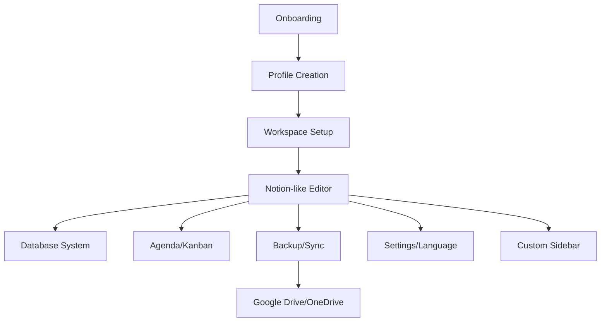

<div align="center">
  
  
  <h1>Bloquinho</h1>
  <h3>Professional Self-Hosted Workspace — 100% Flutter</h3>
  <p>Your private, offline, cross-platform Notion alternative with no limits.</p>
</div>

---

<div align="center">
  
  
  
  
  
  
  
</div>

---

# ✨ What is Bloquinho?

**Bloquinho** is a professional workspace inspired by Notion, built with Flutter, offering a complete self-hosted solution for personal and professional organization. It provides rich text editing, database management, agenda integration, cloud synchronization, and complete privacy control.

> **No paid plans. No limits on blocks, pages, or users. 100% offline and private.**

## 🚀 Future Features

We have an exciting roadmap planned for Bloquinho! Here are the upcoming features that will transform it into a comprehensive productivity platform:

### 📊 Database Integration & Note Management

#### **Smart Note Database**
- **Cloud Synchronization**: Seamless sync across all devices with real-time collaboration
- **Advanced Search**: Full-text search with filters by date, tags, and content type
- **Version History**: Complete revision tracking with diff visualization
- **Backup & Recovery**: Automated backups with point-in-time recovery
- **Import/Export**: Support for popular formats (Notion, Obsidian, OneNote, etc.)

#### **Intelligent Note Linking**
- **Bi-directional Links**: Automatic relationship mapping between related notes
- **Graph Visualization**: Interactive knowledge graph showing note connections
- **Backlinks Panel**: See all notes that reference the current document
- **Smart Suggestions**: AI-powered recommendations for related content
- **Tag Hierarchies**: Nested tagging system with auto-completion

### 📅 Calendar & Agenda Integration

#### **Unified Calendar System**
- **Multi-Calendar Support**: Google Calendar, Outlook, Apple Calendar integration
- **Note-to-Event Linking**: Connect meeting notes directly to calendar events
- **Smart Scheduling**: AI-assisted time blocking and scheduling suggestions
- **Deadline Tracking**: Automatic reminders and progress tracking
- **Time Analytics**: Detailed insights into time allocation and productivity patterns

#### **Task Management**
- **GTD Methodology**: Complete Getting Things Done workflow implementation
- **Kanban Boards**: Visual project management with drag-and-drop functionality
- **Recurring Tasks**: Flexible scheduling for habits and regular activities
- **Priority Matrix**: Eisenhower matrix for task prioritization
- **Team Collaboration**: Shared projects and task assignment

### 🎓 Academic Management System

#### **Student Information System**
- **Course Management**: Semester planning, credit tracking, and GPA calculation
- **Assignment Tracker**: Deadline management with automatic reminders
- **Grade Book**: Comprehensive gradebook with statistical analysis
- **Study Planner**: Intelligent study scheduling based on course load
- **Research Tools**: Citation management and bibliography generation

#### **Educational Features**
- **Flashcard System**: Spaced repetition algorithm for optimal learning
- **Note Templates**: Pre-designed templates for different subjects
- **Collaboration Tools**: Study groups and peer review functionality
- **Progress Analytics**: Learning analytics and performance insights
- **Integration Hub**: Canvas, Moodle, and other LMS integrations

### 💰 Financial Management System

#### **Personal Finance Dashboard**
- **Expense Tracking**: Automated categorization and budget monitoring
- **Income Management**: Multiple income streams tracking
- **Investment Portfolio**: Real-time portfolio tracking and analysis
- **Financial Goals**: SMART goal setting with progress visualization
- **Reporting Suite**: Comprehensive financial reports and insights

#### **Advanced Financial Tools**
- **Cash Flow Forecasting**: Predictive financial planning
- **Tax Management**: Document organization and deduction tracking
- **Bill Reminders**: Automatic bill scheduling and payment alerts
- **Financial Analytics**: Spending patterns and optimization recommendations
- **Multi-Currency Support**: Global currency tracking and conversion

### 🔗 Cross-Platform Integration

#### **Seamless Ecosystem**
- **Mobile Applications**: Native iOS and Android apps with offline support
- **Web Platform**: Full-featured web application with PWA capabilities
- **Desktop Sync**: Real-time synchronization across Windows, macOS, and Linux
- **API Ecosystem**: RESTful API for third-party integrations
- **Plugin Architecture**: Extensible system for community-developed features

#### **Smart Automation**
- **Workflow Engine**: Visual automation builder for complex workflows
- **AI Assistant**: Intelligent assistant for note organization and suggestions
- **Template Engine**: Dynamic templates with conditional logic
- **Integration Marketplace**: Pre-built integrations with popular tools
- **Custom Scripting**: Advanced automation with custom scripts

### 📈 Analytics & Insights

#### **Productivity Intelligence**
- **Usage Analytics**: Detailed insights into writing patterns and productivity
- **Goal Tracking**: Progress monitoring with visual dashboards
- **Time Investment**: Analysis of time spent on different projects
- **Content Analytics**: Word count, reading time, and complexity metrics
- **Habit Formation**: Behavioral insights for building better habits

#### **Collaboration Analytics**
- **Team Performance**: Collaboration metrics and team productivity insights
- **Knowledge Sharing**: Track knowledge distribution and expertise mapping
- **Communication Patterns**: Analysis of collaboration effectiveness
- **Project Insights**: Timeline analysis and milestone tracking
- **Resource Optimization**: Recommendations for improved efficiency

---

### 🗓️ Development Timeline

| Phase | Features | Target Quarter |
|-------|----------|----------------|
| **Phase 1** | Database Integration, Note Linking | Q3 2025 |
| **Phase 2** | Calendar Integration, Basic Task Management | Q4 2025 |
| **Phase 3** | Academic Management System | Q1 2026 |
| **Phase 4** | Financial Management System | Q2 2026 |
| **Phase 5** | Advanced Analytics, AI Features | Q3 2026 |

### 🤝 Get Involved

We believe in community-driven development! Here's how you can contribute to these future features:

- **Feature Requests**: Submit ideas via GitHub Issues
- **Beta Testing**: Join our early access program
- **Community Feedback**: Participate in feature discussions
- **Development**: Contribute code for priority features
- **Documentation**: Help improve our documentation

---

**Stay Updated**: Follow our [GitHub repository](https://github.com/Sen2pi/Bloquinho) for the latest development updates and feature announcements.

*Have a feature idea not listed here? We'd love to hear from you! Open an issue and let's discuss how to make Bloquinho even better.*

## 🚀 Key Features

### 📝 **Notion-like Editor**
- **37 Block Types**: Text, headings, lists, tasks, code, quotes, images, tables, links, embeds, and more
- **Slash Commands**: 20+ commands with real-time search (`/text`, `/h1`, `/list`, `/todo`, `/code`, `/table`, `/page`)
- **Rich Text Formatting**: Bold, italic, strikethrough, underline, code, colors, and links
- **Markdown Conversion**: Automatic conversion when pasting markdown content
- **Endless Page**: Infinite scrolling with optimized performance
- **Real-time Preview**: Split editor with live markdown preview
- **Auto-save**: Intelligent saving with 2-second debounce
- **Visual Status**: "Saving.../Saved" indicators

### 🗂️ **Hierarchical Pages**
- **Infinite Subpages**: Create unlimited nested pages
- **Breadcrumb Navigation**: Visual hierarchy navigation
- **Page Tree Widget**: Professional sidebar with indentation and connector lines
- **Context Menus**: 6 options (subpage, favorite, duplicate, rename, delete)
- **Visual Indicators**: Page counters, favorites, and status icons

### 🗄️ **Integrated Database**
- **17 Field Types**: Text, number, checkbox, select, multi-select, date, deadline, status, rating, progress, file, image, relation, formula, and more
- **Mathematical Operations**: Advanced formulas and calculations
- **Multiple Views**: Table, Kanban, calendar views
- **Complete CRUD**: Add, edit, remove records with full validation
- **Advanced Search**: Filters and search across all data
- **Workspace Isolation**: Each workspace has independent databases

### 📅 **Agenda & Kanban**
- **Calendar Views**: Monthly, weekly, daily visualizations
- **Kanban Boards**: Drag & drop with custom statuses
- **Database Integration**: Deadlines automatically appear in agenda
- **Bidirectional Sync**: Changes reflect in both systems
- **Event Management**: Create, edit, and manage events

### ☁️ **Backup & Cloud Sync**
- **Local Backup**: Complete JSON backup with flexible restoration
- **Automatic Backup**: Scheduled backups with history retention
- **Cloud Synchronization**: Google Drive and OneDrive integration
- **OAuth2 Authentication**: Secure real-time authentication
- **Restoration Options**: Merge or replace data
- **Export/Import**: Transfer data between devices

### 🌍 **Multi-language Support**
- **3 Languages**: Portuguese (PT-BR), English (EN-US), French (FR-FR)
- **100% Translated**: All screens, menus, dialogs, and messages
- **Real-time Switching**: Change language anytime in settings
- **Localized Validation**: Form validation messages in all languages

### 🔐 **Security & Privacy**
- **100% Local**: No data leaves your device without permission
- **Encryption**: Sensitive data protection
- **No Telemetry**: No analytics, tracking, or data collection
- **Self-hosted**: You control everything
- **OAuth2 Security**: Secure cloud authentication

### 🎨 **Professional Interface**
- **Dark/Light Mode**: Complete theme support
- **Custom Icons**: Professional icon system
- **Responsive Design**: Works on all screen sizes
- **Workspace Isolation**: Multiple contexts with independent data
- **Modern UI**: Material Design 3 with custom components

## 🏗️ Architecture & Technology

### **Flutter Architecture**


### **Core Technologies**
- **Flutter 3.19+**: Cross-platform development
- **Riverpod**: Reactive state management
- **Hive**: Local data persistence
- **GoRouter**: Navigation system
- **OAuth2**: Cloud authentication
- **Phosphor Icons**: Consistent iconography

### **Data Structure**
```
profile/
├── user_profile.json
├── settings.json
└── workspaces/
    ├── personal/
    │   ├── bloquinho/
    │   ├── database/
    │   ├── agenda/
    │   ├── documents/
    │   └── passwords/
    └── work/
        └── [same structure]
```

## 🚀 Quick Start

### **Prerequisites**
- **Flutter 3.19+** installed
- **Git** for version control
- **Platform-specific tools** (see build guides below)

### **Installation**
```bash
# Clone the repository
git clone https://github.com/Sen2pi/Bloquinho.git
cd Bloquinho

# Install dependencies
flutter pub get

# Run on your preferred platform
flutter run -d windows    # Windows
flutter run -d macos      # macOS
flutter run -d linux      # Linux
flutter run -d chrome     # Web
```

## 🛠️ Build Guides

### **Linux Build Guide**

#### **Ubuntu/Debian**
```bash
# Install dependencies
sudo apt update
sudo apt install -y \
    clang \
    cmake \
    ninja-build \
    pkg-config \
    libgtk-3-dev \
    liblzma-dev \
    libstdc++-12-dev

# Install Flutter
sudo snap install flutter --classic
# OR download from https://flutter.dev/docs/get-started/install/linux

# Verify installation
flutter doctor

# Build and run
cd Bloquinho
flutter pub get
flutter run -d linux
```

#### **Fedora/RHEL**
```bash
# Install dependencies
sudo dnf install -y \
    clang \
    cmake \
    ninja-build \
    pkg-config \
    gtk3-devel \
    xz-devel \
    libstdc++-devel

# Continue with Flutter installation...
```

### **macOS Build Guide**

#### **System Requirements**
- **macOS 10.14+** (Mojave or later)
- **Xcode 12+** with Command Line Tools
- **Flutter 3.19+**

#### **Installation Steps**
```bash
# Install Homebrew (if not installed)
/bin/bash -c "$(curl -fsSL https://raw.githubusercontent.com/Homebrew/install/HEAD/install.sh)"

# Install Xcode Command Line Tools
xcode-select --install

# Install Flutter via Homebrew
brew install --cask flutter

# OR download manually from https://flutter.dev/docs/get-started/install/macos

# Verify installation
flutter doctor

# Build and run
cd Bloquinho
flutter pub get
flutter run -d macos
```

#### **Troubleshooting macOS**
```bash
# If you get signing errors
flutter config --enable-macos-desktop

# If you need to accept licenses
flutter doctor --android-licenses

# For M1 Macs, ensure you're using the right architecture
arch -x86_64 flutter run -d macos  # If needed
```

### **Cross-Platform Development**

#### **Enable Desktop Support**
```bash
# Enable all desktop platforms
flutter config --enable-windows-desktop
flutter config --enable-macos-desktop
flutter config --enable-linux-desktop

# Verify available devices
flutter devices
```

#### **Build for Distribution**
```bash
# Build release versions
flutter build windows --release
flutter build macos --release
flutter build linux --release
flutter build web --release

# Output locations
# Windows: build/windows/runner/Release/
# macOS: build/macos/Build/Products/Release/
# Linux: build/linux/x64/release/bundle/
# Web: build/web/
```

## 📱 Platform Support

| Platform | Status | Notes |
|----------|--------|-------|
| **Windows** | ✅ Full Support | Native desktop app |
| **macOS** | ✅ Full Support | Native desktop app |
| **Linux** | ✅ Full Support | Native desktop app |
| **Web** | ✅ Full Support | Progressive Web App |
| **Android** | 🔄 In Development | Mobile app planned |
| **iOS** | 🔄 In Development | Mobile app planned |

## 🎯 Advanced Features

### **OAuth2 Cloud Integration**
- **Google Drive**: Real-time sync with OAuth2 authentication
- **OneDrive**: Microsoft Graph API integration
- **Dynamic Ports**: Automatic port selection for callbacks
- **Secure Storage**: Encrypted token management
- **Auto-refresh**: Automatic token renewal

### **Avatar System**
- **OAuth2 Integration**: Automatic avatar download from Google/Microsoft
- **Local Cache**: Intelligent caching with metadata
- **Cross-platform**: URL support for web, file support for mobile
- **Fallback System**: Initials when no avatar available
- **Auto-cleanup**: Automatic cache management

### **Workspace Management**
- **Multiple Contexts**: Personal, Work, Studies workspaces
- **Isolated Data**: Each workspace has independent data
- **Custom Icons**: Professional icon selection
- **Color Themes**: Workspace-specific color schemes
- **Quick Actions**: Fast workspace switching

### **Database System**
- **17 Field Types**: Complete data modeling
- **Mathematical Operations**: Advanced calculations
- **File Attachments**: Document and image support
- **Status Tracking**: Progress and deadline management
- **Formula Engine**: Custom calculations and relationships

## 🔧 Development

### **Project Structure**
```
lib/
├── core/                    # Core services and models
│   ├── constants/          # App constants
│   ├── l10n/              # Internationalization
│   ├── models/            # Data models
│   ├── services/          # Business logic
│   └── theme/             # UI theming
├── features/              # Feature modules
│   ├── agenda/           # Calendar and events
│   ├── auth/             # Authentication
│   ├── backup/           # Backup system
│   ├── bloquinho/        # Main editor
│   ├── database/         # Database system
│   ├── documentos/       # Document management
│   ├── passwords/        # Password manager
│   ├── profile/          # User profiles
│   ├── settings/         # App settings
│   └── workspace/        # Workspace management
├── shared/               # Shared components
│   ├── models/           # Shared models
│   ├── providers/        # State management
│   └── widgets/          # Reusable widgets
└── main.dart             # App entry point
```

### **Key Dependencies**
```yaml
dependencies:
  flutter_riverpod: ^2.4.9    # State management
  go_router: ^12.1.3          # Navigation
  hive: ^2.2.3               # Local storage
  phosphor_flutter: ^2.0.1    # Icons
  oauth2: ^2.0.2             # Cloud authentication
  url_launcher: ^6.2.1       # URL handling
  flutter_secure_storage: ^9.0.0  # Secure storage
  path_provider: ^2.1.1      # File system
  intl: ^0.18.1              # Internationalization
  crypto: ^3.0.3             # Hashing
  uuid: ^4.1.0               # Unique IDs
```

### **Testing**
```bash
# Run all tests
flutter test

# Run specific test file
flutter test test/user_profile_test.dart

# Run with coverage
flutter test --coverage
```

## 📊 Performance Metrics

### **Current Status**
- **99.8% Complete**: All core features implemented
- **37 Block Types**: Complete Notion-like editor
- **20+ Slash Commands**: Professional editing experience
- **3 Languages**: Full internationalization
- **2 Cloud Providers**: Google Drive + OneDrive
- **4 Platforms**: Windows, macOS, Linux, Web

### **Performance Benchmarks**
- **Startup Time**: <3 seconds
- **Editor Response**: <100ms
- **Auto-save**: 2-second debounce
- **Memory Usage**: Optimized for desktop
- **File Size**: <50MB per platform

## 🤝 Contributing

We welcome contributions! Please see our [Contributing Guide](CONTRIBUTING.md) for details.

### **Development Setup**
```bash
# Fork and clone
git clone https://github.com/your-username/Bloquinho.git
cd Bloquinho

# Install dependencies
flutter pub get

# Run tests
flutter test

# Start development
flutter run -d windows  # or your preferred platform
```

### **Code Style**
- Follow Flutter/Dart conventions
- Use meaningful variable names
- Add comments for complex logic
- Write tests for new features
- Update documentation

## 📄 License

This project is licensed under **CC BY-NC-SA 4.0** - see the [LICENSE](LICENSE) file for details.

- ✅ **Non-commercial use**: Free for personal, educational, and research purposes
- ❌ **Commercial use**: Prohibited without permission
- 📧 **Commercial licensing**: Contact [dr.karim.patatas@gmail.com] for commercial rights

**Note**: This license change protects the project from unauthorized commercial use while keeping it accessible for the community.


## 💝 Support & Donate

Bloquinho is a free, open-source project made with ❤️ for everyone. Your support helps keep the platform free, private, and innovative for thousands of people.

### **Why Donate?**
- **Keep it Free**: No paid plans or limitations
- **Support Development**: Independent development and innovation
- **Privacy First**: Your data stays yours
- **Open Source**: Transparent and community-driven

### **Donation Options**
<div align="center">
  
  
  **PayPal**: [Donate via PayPal](https://paypal.me/your-paypal-link)
  
  **Contact**: dr.karim.patatas@gmail.com
</div>

### **Connect With Us**
- **Email**: dr.karim.patatas@gmail.com
- **LinkedIn**: [linkedin.com/in/k-patatas](https://www.linkedin.com/in/k-patatas/)
- **GitHub**: [github.com/Sen2pi](https://github.com/Sen2pi)
- **Website**: [bloquinho.kpsolucoes.pt](https://bloquinho.kpsolucoes.pt/)
- **Portfolio**: [portfoliokarimsantos.vercel.app](https://portfoliokarimsantos.vercel.app/)

---

<div align="center">
  <p><strong>Made with ❤️ by the Bloquinho Team</strong></p>
  <p>If Bloquinho makes a difference in your life, consider supporting independent development!</p>
</div>
