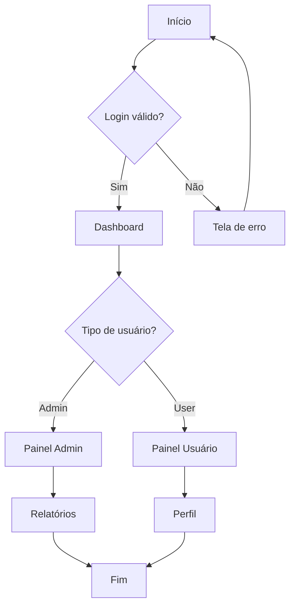
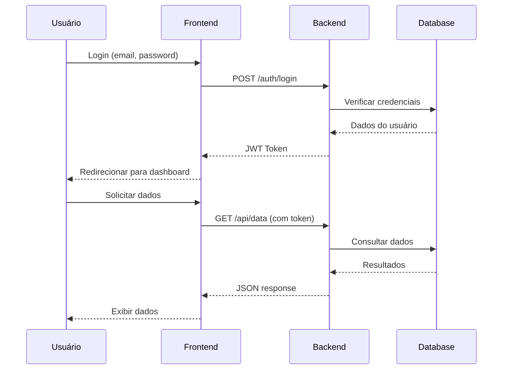
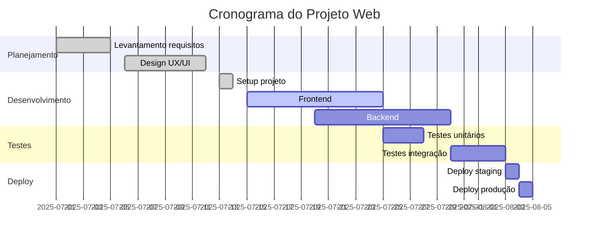

# 📊 Documento Markdown Completo com Todas as Funcionalidades

## 🎨 Demonstração de Cores e Formatação

Este documento exemplifica **todas as principais funcionalidades** do Markdown, incluindo <span style="color:red; background-color:#ffeeee; padding:2px 5px; border-radius:3px">**cores personalizadas**</span> e formatação avançada

### Exemplos de Texto <bg color="bg-red">Colorido</bg>

Aqui temos diferentes estilos de texto:

- <span style="color:red">**Texto vermelho em negrito**</span>
- <span style="color:blue; font-style:italic">Texto azul em itálico</span>
- <span style="color:white; background-color:green; padding:3px 8px; border-radius:5px">✅ Sucesso</span>
- <span style="color:white; background-color:red; padding:3px 8px; border-radius:5px">❌ Erro</span>
- <span style="color:orange; background-color:#fff3cd; padding:3px 8px; border-radius:5px">⚠️ Aviso</span>


## 📝 Hierarquia de Títulos

# Título Nível 1

## Título Nível 2

### Título Nível 3

#### Título Nível 4

##### Título Nível 5

###### Título Nível 6

### Títulos Alternativos

Título Principal
===============

Subtítulo
---------

## 💻 Exemplos de Código

### Código Python

```python
def calcular_fibonacci(n):
    """Calcula a sequência de Fibonacci até n termos"""
    if n <= 0:
        return []
    elif n == 1:
        return [0]
    elif n == 2:
        return [0, 1]
    
    fib = [0, 1]
    for i in range(2, n):
        fib.append(fib[i-1] + fib[i-2])
    
    return fib

# Exemplo de uso
resultado = calcular_fibonacci(10)
print(f"Fibonacci(10): {resultado}")
```


### Código JavaScript

```javascript
// Classe para gerenciar usuários
class UsuarioManager {
    constructor() {
        this.usuarios = [];
    }
    
    adicionarUsuario(nome, email) {
        const usuario = {
            id: Date.now(),
            nome: nome,
            email: email,
            ativo: true
        };
        this.usuarios.push(usuario);
        return usuario;
    }
    
    buscarUsuario(id) {
        return this.usuarios.find(u => u.id === id);
    }
}

// Uso da classe
const manager = new UsuarioManager();
const novoUsuario = manager.adicionarUsuario("João", "joao@email.com");
console.log(novoUsuario);
```


### Código SQL

```sql
-- Criação de tabela e consultas avançadas
CREATE TABLE vendas (
    id SERIAL PRIMARY KEY,
    produto VARCHAR(100) NOT NULL,
    preco DECIMAL(10,2),
    data_venda DATE,
    vendedor_id INTEGER
);

-- Consulta com agregações
SELECT 
    vendedor_id,
    COUNT(*) as total_vendas,
    SUM(preco) as receita_total,
    AVG(preco) as preco_medio,
    MAX(data_venda) as ultima_venda
FROM vendas 
WHERE data_venda >= '2025-01-01'
GROUP BY vendedor_id
HAVING SUM(preco) > 1000
ORDER BY receita_total DESC;
```


### Código Inline

Para executar o script, use o comando <span style="color:white; background-color:black; padding:2px 5px; border-radius:3px; font-family:monospace">python app.py</span> no terminal.

## 🔢 Fórmulas Matemáticas (LaTeX)

### Fórmulas Inline

A famosa equação de Einstein: $E = mc^2$

A fórmula quadrática: $x = \frac{-b \pm \sqrt{b^2 - 4ac}}{2a}$

### Fórmulas em Bloco

Integral definida:

$
\int_a^b f(x) \, dx = F(b) - F(a)
$

Somatório:

$
\sum_{i=1}^{n} i = \frac{n(n+1)}{2}
$

Matriz:

$
\begin{pmatrix}
a & b \\
c & d
\end{pmatrix}
\begin{pmatrix}
x \\
y
\end{pmatrix}
=
\begin{pmatrix}
ax + by \\
cx + dy
\end{pmatrix}
$

Limite:

$
\lim_{x \to \infty} \frac{1}{x} = 0
$

## 📊 Tabelas Avançadas

### Tabela de Vendas Mensais

| Mês | Vendas | Meta | <span style="color:green">%Atingido</span> | Status |
| :-- | :-- | :-- | :-- | :-- |
| Janeiro | €15.000 | €12.000 | <span style="color:green; font-weight:bold">125%</span> | <span style="color:white; background-color:green; padding:2px 6px; border-radius:3px">✅ Superou</span> |
| Fevereiro | €10.500 | €12.000 | <span style="color:orange; font-weight:bold">87.5%</span> | <span style="color:white; background-color:orange; padding:2px 6px; border-radius:3px">⚠️ Abaixo</span> |
| Março | €14.200 | €12.000 | <span style="color:green; font-weight:bold">118%</span> | <span style="color:white; background-color:green; padding:2px 6px; border-radius:3px">✅ Superou</span> |

### Tabela com Alinhamentos

| Produto | Preço | Quantidade | Total |
| :-- | --: | --: | --: |
| Notebook | €899.99 | 5 | €4.499,95 |
| Mouse | €25.50 | 10 | €255,00 |
| Teclado | €75.00 | 8 | €600,00 |
| **Total** |  |  | **€5.354,95** |

## 📋 Listas e Tarefas

### Lista de Tarefas do Projeto

- [x] <span style="color:green">**Análise de requisitos**</span> ✅
- [x] <span style="color:green">**Design da interface**</span> ✅
- [ ] <span style="color:orange">**Desenvolvimento backend**</span> 🔄
    - [x] Configuração do banco de dados
    - [x] API de autenticação
    - [ ] API de usuários
    - [ ] API de relatórios
- [ ] <span style="color:red">**Testes**</span> ⏳
- [ ] <span style="color:red">**Deploy**</span> ⏳


### Lista Hierárquica

1. **Desenvolvimento**

2. Frontend
        - React.js
        - CSS/SCSS
        - TypeScript
3. Backend
        - Node.js
        - Express
        - PostgreSQL
1. **Testes**
    - Unitários
    - Integração
    - E2E
2. **Deployment**
    - Staging
    - Produção

## 📈 Diagramas

### Fluxograma do Processo




### Diagrama de Sequência




### Gráfico de Gantt




## 💬 Citações e Destaques

### Citação Simples

> "A melhor forma de prever o futuro é criá-lo."
> — Peter Drucker

### Citação Aninhada

> **Princípio do desenvolvimento ágil:**
>
> > "Indivíduos e interações mais que processos e ferramentas"
> > "Software em funcionamento mais que documentação abrangente"
>
> Este princípio revolucionou a forma como desenvolvemos software.

### Caixa de Destaque

<span style="background-color:#e1f5fe; border-left:4px solid #0277bd; padding:10px; display:block; margin:10px 0;">
<strong>💡 Dica Importante:</strong><br>
Sempre faça backup dos seus dados antes de realizar atualizações importantes no sistema.
</span>

## 🔗 Links e Referências

### Links Básicos

- [Documentação Markdown](https://www.markdownguide.org)
- [Mermaid Diagrams](https://mermaid.js.org/)
- [LaTeX Mathematics](https://katex.org/)


### Links com Referência

Consulte a [documentação oficial](https://www.markdownguide.org) para mais informações sobre [sintaxe avançada](https://www.markdownguide.org/extended-syntax/).

## 📊 Elementos Visuais

### Badges e Indicadores

<span style="background-color:#28a745; color:white; padding:2px 8px; border-radius:12px; font-size:12px; font-weight:bold;">ATIVO</span>
<span style="background-color:#ffc107; color:black; padding:2px 8px; border-radius:12px; font-size:12px; font-weight:bold;">PENDENTE</span>
<span style="background-color:#dc3545; color:white; padding:2px 8px; border-radius:12px; font-size:12px; font-weight:bold;">INATIVO</span>

### Progresso Visual

**Progresso do Projeto:**

<div style="background-color:#f0f0f0; border-radius:10px; padding:3px; margin:10px 0;">
<div style="background-color:#28a745; width:75%; height:20px; border-radius:8px; display:flex; align-items:center; justify-content:center; color:white; font-weight:bold; font-size:12px;">
75% Completo
</div>
</div>

## 📝 Parágrafos e Formatação

### Texto com Formatação Mista

Este parágrafo demonstra **texto em negrito**, *texto em itálico*, ***texto em negrito e itálico***, ~~texto riscado~~, e `código inline`.

Também podemos ter <span style="color:blue; text-decoration:underline">texto sublinhado azul</span>, <span style="background-color:yellow">texto destacado</span>, e <span style="color:red; font-weight:bold">texto vermelho em negrito</span>.

### Parágrafo com Espaçamento

Este é o primeiro parágrafo com informações importantes sobre o projeto.

Este é o segundo parágrafo, separado por uma linha em branco. Aqui falamos sobre aspectos técnicos específicos.

Para forçar uma quebra de linha
sem criar um novo parágrafo, use dois espaços no final da linha.

## 🛠️ Elementos HTML Avançados

### Detalhes Expansíveis

<details>
<summary><strong>📋 Clique para ver os requisitos do sistema</strong></summary>

**Requisitos mínimos:**
- Sistema operacional: Windows 10 ou superior
- Memória RAM: 8GB
- Espaço em disco: 50GB
- Processador: Intel i5 ou equivalente

**Requisitos recomendados:**
- Sistema operacional: Windows 11
- Memória RAM: 16GB
- Espaço em disco: 100GB SSD
- Processador: Intel i7 ou superior

</details>

### Teclas e Atalhos

Para salvar o arquivo, pressione <kbd>Ctrl</kbd> + <kbd>S</kbd>

Para copiar, use <kbd>Ctrl</kbd> + <kbd>C</kbd>

### Texto Especial

O valor de π (pi) é aproximadamente 3.14159...

A fórmula da água é H<sub>2</sub>O

Einstein descobriu que E=mc<sup>2</sup>

<mark>Este texto está destacado</mark> para chamar atenção.

## 📈 Estatísticas do Projeto

### Métricas de Performance

| Métrica | Valor Atual | Meta | Variação |
| :-- | :-- | :-- | :-- |
| Uptime | <span style="color:green; font-weight:bold">99.9%</span> | 99.5% | <span style="color:green">+0.4% ↗️</span> |
| Response Time | <span style="color:orange; font-weight:bold">150ms</span> | 100ms | <span style="color:red">+50ms ↗️</span> |
| Error Rate | <span style="color:green; font-weight:bold">0.1%</span> | 0.5% | <span style="color:green">-0.4% ↘️</span> |
| Users Active | <span style="color:blue; font-weight:bold">1,247</span> | 1,000 | <span style="color:green">+247 ↗️</span> |

## 🏁 Conclusão

Este documento demonstra a versatilidade e poder do Markdown quando combinado com HTML e outras tecnologias. Com essas técnicas, é possível criar documentação rica, colorida e interativa que vai muito além do texto simples.

<span style="background-color:#e8f5e8; border:1px solid #4caf50; border-radius:5px; padding:15px; display:block; margin:20px 0;">
<strong style="color:#2e7d32;">✅ Documento Completo</strong><br>
Este exemplo inclui todas as principais funcionalidades do Markdown moderno, servindo como referência completa para criação de documentos profissionais.
</span>
*Documento criado em 12 de julho de 2025 - Guimarães, Portugal* 🇵🇹

